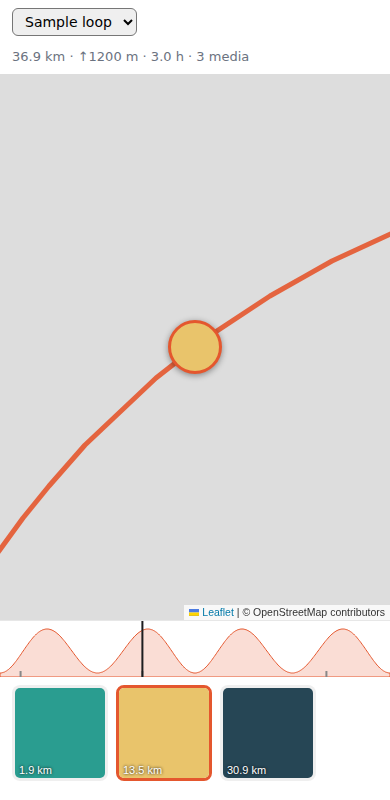

# Tour of Map

Interactive, mobile-friendly map of bike tours: GPX track + photos/videos placed along the route.



## Add a tour

```
tours/<slug>/
  track.gpx            # from Strava/Garmin/Komoot export
  *.jpg *.heic *.mp4 *.mov
  meta.json            # optional
```

```bash
npm install
npm run tours   # processes tours/ → public/tours/ (resized images, thumbnails, tour.json)
npm run dev
```

### How media gets placed
1. `meta.json` manual `lat`/`lon` for a file, else
2. EXIF GPS (phone photos), else
3. **capture time matched against GPX timestamps** — works for GPS-less cameras, GoPros, videos.

If your camera clock is off (or in local time instead of UTC), set `timeOffsetMinutes` in `meta.json`
(e.g. `-120` for a camera set to CEST). Videos have no EXIF: set `"time"` per file in `meta.json`,
otherwise file mtime is used (often wrong after copying).

```json
{
  "title": "Annecy loop",
  "timeOffsetMinutes": 0,
  "media": { "GX010042.mp4": { "caption": "Descent", "time": "2026-06-01T09:40:00Z" } }
}
```

## Features
- Track, start marker, photo pins (thumbnail avatars) on OSM tiles (React + react-leaflet)
- Media strip synced with the map; tap again to open full screen (swipe / arrow keys)
- Elevation profile you can scrub to move along the route
- Bottom sheet on phones, side panel on desktop; multiple tours via `#slug`

## Deploy
Fully static: `npm run build` → `dist/`. Netlify/Vercel/Cloudflare Pages as-is;
GitHub Pages with `BASE=/tour-of-map/ npm run build`.
Large videos: transcode first (`ffmpeg -i in.mov -vf scale=-2:1080 -crf 26 out.mp4`), or host them on a CDN.
